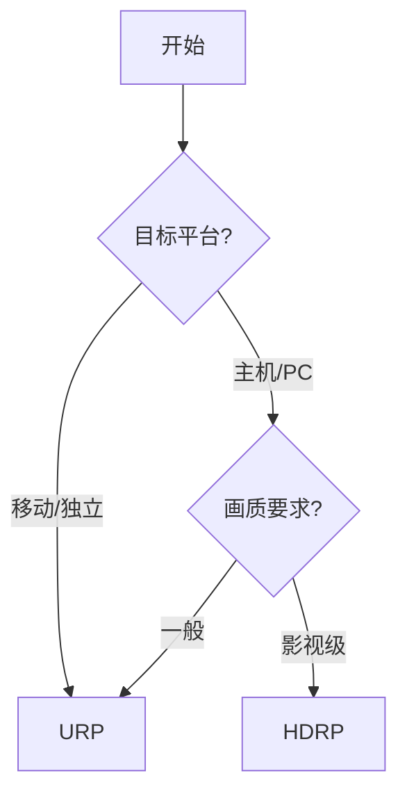

# Unity6渲染管线全面解析

## Scriptable Render Pipeline 简介

Unity 6推出了全新的SRP (Scriptable Render Pipeline)，让开发者完全控制渲染流程。

### 内置管线 vs SRP

| 特性 | Built-in | URP | HDRP |
|------|----------|-----|------|
| 灵活性 | 低 | 中 | 高 |
| 画质 | 一般 | 良好 | 影视级 |
| 性能 | 中等 | 优化 | 较高需求 |
| 学习曲线 | 低 | 中 | 高 |

## URP (Universal Render Pipeline)

### 适用场景

- 移动平台
- 低中端PC
- VR应用
- 独立游戏

### URP设置

```csharp
// 创建URP Asset
AssetDatabase.CreateAsset(CreateInstance<UniversalRenderPipelineAsset>(), "Assets/Settings/URPAsset.asset");

// Project Settings配置
GraphicsSettings.renderPipelineAsset = urpAsset;
```

### URP特性

```hlsl
// URP中的Shader实现
Shader "Custom/ToonShader"
{
    Properties
    {
        _MainTex ("Texture", 2D) = "white" {}
        _Color ("Tint", Color) = (1,1,1,1)
        [HDR] _Emission ("Emission", Color) = (0,0,0,1)
    }
}
```

## HDRP (High Definition Render Pipeline)

### 适用场景

- 主机游戏
- 高端PC
- 影视制作
- 建筑可视化

### HDRP物理光照

| 特性 | 说明 |
|------|------|
| 体积雾 | 体积渲染实现真实雾效 |
| 屏幕空间反射 | SSR技术 |
| 光线追踪 | 支持RTX硬件加速 |
| 区域光 | 矩形/圆形/管线光源 |

### HDRP配置

```csharp
// 启用光线追踪
HDRenderPipelineAsset asset = GetHDRenderPipelineAsset();
asset rayTracing = true;
asset.shaderRayTracing = true;
```

## 如何选择



## Shader Graph集成

### URP Shader Graph

```csharp
// 创建Custom Function Node
public class CustomNode : CodeFunctionNode
{
    protected override string GetFunctionName() => "CustomLighting";

    protected override MethodDefinition GetFunction()
    {
        return GetFunction("float3 CustomLight(float3 N, float3 V)");
    }
}
```

## Unity 6新特性

| 特性 | URP | HDRP |
|------|-----|------|
| 体积云 | ✅ | ✅ |
| GPU光栅化 | ✅ | ✅ |
| 路径追踪 | ❌ | ✅预览 |
| 自适应探测 | ✅ | ✅ |

## 总结

- **URP**：轻量、跨平台、性能优先
- **HDRP**：高画质、影视效果、硬件要求高
- **内置**：兼容性最好，但灵活性差

根据项目需求选择合适的渲染管线是成功的关键。
